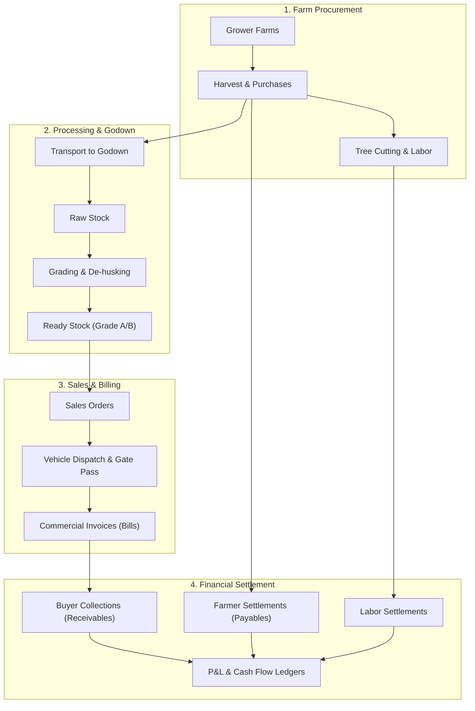

# 🌴 Rakshi Coco ERP — Comprehensive Project Completion Report

**Project**: Rakshi Coco Enterprise Resource Planning (ERP) System  
**Target Platform**: Responsive Web & Android Mobile (APK / PWA)  
**Production Runtime**: `http://localhost:3000`  
**GitHub Repository**: [https://github.com/rakshicoco/rakshicoco](https://github.com/rakshicoco/rakshicoco)  
**Branch**: `main`  
**Date**: September 18, 2026  

---

## Executive Summary

The **Rakshi Coco ERP** application is a production-ready, mobile-first business management platform purpose-built for commercial coconut procurement, godown inventory processing, sales order fulfillment, buyer billing, and financial ledger accounting.

All requested features, architectural optimizations, Android mobile ergonomics, official branding assets, route completions, and dashboard visual alignments have been developed, tested in-browser, and pushed to GitHub.

---

## 1. System Architecture & Workflows

---

## 2. Milestone Breakdown & Accomplishments

### Phase 1: Core Foundation & Version Control
- **Next.js 14 App Router & TypeScript**: Full SSR architecture, modular layouts, and route protection.
- **Supabase PostgreSQL Database**: Complete normalized relational schema with RLS policies, automated timestamps, and triggers.
- **FAT32 USB Drive Compatibility**: Devised a dual-location setup utilizing `C:\Users\RITHISH\rakshi-coco` for high-throughput node I/O while maintaining `E:\Rakshi Coco` as the authoritative Git workspace.
- **GitHub Repository**: Initialized, synced, and maintained at `https://github.com/rakshicoco/rakshicoco`.

### Phase 2: Complete Operational Modules
- **Farms**: Registered coconut growers, GPS acreage, cutting schedules, yield trackers.
- **Procurement & Cutting**: Harvest quantity recording, tender nut vs mature nut count, contract pricing.
- **Godowns & Inventory**: Real-time stock levels, movement history, damage/wastage logging.
- **Sales & Logistics**: Buyer profiles, order creation, vehicle load tracking, gate pass dispatch.
- **Billing & Invoices**: Multi-item commercial bills, tax calculations, balance tracking.
- **Finance & P&L**: Income statements, receivables/payables aging, cash flow reconciliation.

### Phase 3: Android Mobile-First Optimization (APK / PWA)
- **TopBar**: Native sticky header with safe-area notch padding (`pt-safe`), brand emblem, contextual route titles, and auto-back navigation.
- **BottomNav**: Android Material 3 pill navigation, gesture bar safe-area padding (`pb-safe`), tactile tap scale.
- **Floating Action Button (FAB)**: Speed-dial menu with backdrop blur, relocated above bottom navigation to prevent gesture collisions.
- **Touch Responsiveness**: Wrapped 23+ data tables with horizontal touch scrolling (`overflow-x-auto`), eliminated tap delays, and set minimum 16px input font size to prevent mobile browser zoom.

### Phase 4: Official Branding & Logo Integration
- **Logo Assets**: Ingested `E:\Rakshi Coco\logo\image.png` and created:
  - `/public/logo.png` & `/public/icon.png`
  - `/public/favicon.ico` & `src/app/favicon.ico`
  - `src/app/icon.png`
- **PWA Web App Manifest (`src/app/manifest.ts`)**: Configured 192×192 and 512×512 icons for Android home screen and standalone APK installs.
- **Animated Loading Screen (`LoadingSpinner.tsx`)**: Created pulsating coconut brand emblem with glowing emerald halo and rotating gradient spinner for route transitions.
- **Universal Placement**: Embedded the logo in the Login screen hero, sticky TopBar, Mobile Drawer header, and Commercial Invoices.

### Phase 5: Route Completion & 404 Resolution
- Built `src/app/dashboard/buyer-payments/new/page.tsx`, resolving the 404 error when clicking "New Payment" from the mobile FAB button.

### Phase 6: Executive Dashboard Reorganization
- **Top Welcome Bar**: "Live Coconut ERP" status indicator with pulsating emerald beacon and date badge (`Fri, 18 Sept`).
- **Financial Working Capital**: Clean cards for **Receivables** (with incoming emerald arrow) and **Payables** (with outgoing amber arrow).
- **Physical Assets Bento**: **Ready Stock** displaying unit-annotated count (`0 nuts`) and **Farm Network** displaying active coconut groves.
- **Quick Launchpad**: 4 thumb-friendly direct action buttons for **Purchase**, **Sale Bill**, **Payment**, and **New Farm**.
- **Pipeline & Tasks**: Structured cards for **Pending Harvests** and **Pending Deliveries** with status pills and right chevrons.
- **Facility Status**: Kangeyam Main Godown operational indicator with direct stock navigation.

---

## 3. Git Commit History

| Commit Hash | Message | Scope |
| :--- | :--- | :--- |
| `eb7844b` | `feat(dashboard): refine mobile ERP dashboard arrangement, launchpad, and financial cards` | Dashboard UI/UX Alignment |
| `515a1d5` | `feat(branding): integrate official Rakshi Coco logo, favicon, loading spinner, manifest, and topbar branding` | Brand Logo, Favicon, PWA Manifest, 404 Fix |
| `74def0e` | `feat(mobile): optimize UI/UX layout for Android mobile APK` | Android Mobile-First Optimization |
| `857945f` | `feat: complete Rakshi Coco ERP core modules and database integration` | Core Application Build |

---

## 4. Key Files Reference

- **Dashboard**: [`src/app/dashboard/page.tsx`](file:///E:/Rakshi%20Coco/src/app/dashboard/page.tsx)
- **Top Navigation Bar**: [`src/components/navigation/TopBar.tsx`](file:///E:/Rakshi%20Coco/src/components/navigation/TopBar.tsx)
- **Bottom Navigation**: [`src/components/navigation/BottomNav.tsx`](file:///E:/Rakshi%20Coco/src/components/navigation/BottomNav.tsx)
- **Navigation Drawer**: [`src/components/navigation/MobileDrawer.tsx`](file:///E:/Rakshi%20Coco/src/components/navigation/MobileDrawer.tsx)
- **Floating Action Button**: [`src/components/ui/QuickActionButton.tsx`](file:///E:/Rakshi%20Coco/src/components/ui/QuickActionButton.tsx)
- **Animated Loading Spinner**: [`src/components/ui/LoadingSpinner.tsx`](file:///E:/Rakshi%20Coco/src/components/ui/LoadingSpinner.tsx)
- **Web App Manifest**: [`src/app/manifest.ts`](file:///E:/Rakshi%20Coco/src/app/manifest.ts)
- **Buyer Payment Form**: [`src/app/dashboard/buyer-payments/new/page.tsx`](file:///E:/Rakshi%20Coco/src/app/dashboard/buyer-payments/new/page.tsx)
- **Database Schema**: [`supabase/migrations/0000_initial_schema.sql`](file:///E:/Rakshi%20Coco/supabase/migrations/0000_initial_schema.sql)
